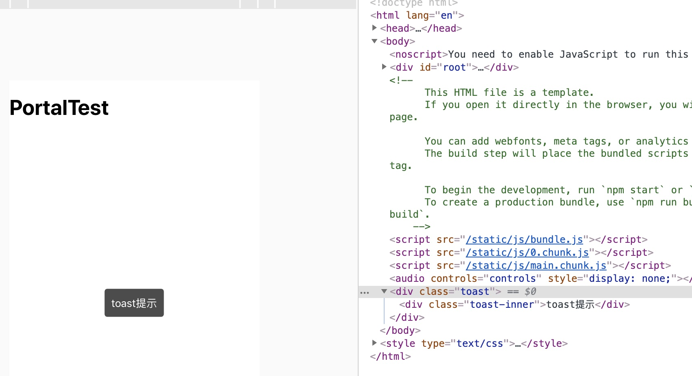

<!-- TOC -->

- [代码分割](#代码分割)
- [Context](#context)
- [错误边界](#错误边界)
- [Fragments](#fragments)
- [Portals](#portals)
- [forwardRef](#forwardref)
- [小结](#小结)

<!-- /TOC -->

用了那么久的react, 竟不知道到原来react有那么多高级特性. 假期没事干, 试用了下一些react高级特性. 下为试用记录.


## 代码分割

将一个庞大的单页应用打包成一个庞大的js, 首屏加载可能会非常糟糕, 这时可能会考虑做代码分割, 即根据模块或者路由分开打包js, 异步按需加载组件.

借助`webpack`和一些异步组件库(比如[react-loadable](https://www.npmjs.com/package/react-loadable), 也可以自己实现异步组件)就能很方便的实现这一点. 比如像下面这样:

```javascript
// router.js
import React from 'react';
import Loadable from 'react-loadable';

const Loading = () => <div>Loading...</div>;

///////////////页面路由配置////////////////

const Routers = {
    // 首页
    '/': Loadable({
        loader: () => import(/* webpackChunkName: "index" */'./pages/Index.jsx'),
        loading: Loading,
      }),
    // 首页
    '/index': Loadable({
        loader: () => import(/* webpackChunkName: "index" */'./pages/Index.jsx'),
        loading: Loading,
    }),
    '/404': Loadable({
        loader: () => import(/* webpackChunkName: "404" */'./pages/404/index'),
        loading: Loading, 
    })
}

export default Routers;

// App.js
import React, { Component } from 'react';
import { BrowserRouter as Router, Route, Link, Switch } from "react-router-dom";

import Routers from './router';

class App extends Component {
  componentDidMount() {

  }
  render() {
    return (
      <Router>
          <Switch>
            <Route path="/" exact component={Routers["/"]} />
            <Route path="/index" exact component={Routers["/index"]} />
            <Route component={Routers['/404']} />
          </Switch>
      </Router>
    );
  }
}

export default App;
```

我们直接使用`Loadable`创建异步组件, 在合适的时候使用, `webpack`会帮我做好代码分割, `Loadable`可以帮我们维护好异步组件的状态, 并且能够支持定义加载中的组件. 上边demo完整版参见[web-test](https://github.com/yibingxiong/web-test).


其实, react已经原生提供了异步组件的支持, 其使用和`Loadable`大体相同, 但是看起来会更加优雅.

```javascript
import { BrowserRouter as Router, Route, Switch } from 'react-router-dom';
import React, { Suspense, lazy } from 'react';

const Home = lazy(() => import(/* webpackChunkName: "home" */'./pages/Home'));
const About = lazy(() => import(/* webpackChunkName: "about" */'./pages/About'));

const App = () => (
  <Router>
    <Suspense fallback={<div>Loading...</div>}>
      <Switch>
        <Route exact path="/" component={Home} />
        <Route path="/about" component={About} />
      </Switch>
    </Suspense>
  </Router>
);

export default App;
```

这里我们使用`React.lazy`方法创建异步组件, 和`Loadable`类似, 也是使用了`import`方法, webpack会帮我们处理好这个import. 不同的是他并不支持定义loading, loading的自定义可以使用`Suspense`组件. 在其fallback中可以创建自定义的loading组件. 这个demo的完整版可参考[react-demo](https://github.com/yibingxiong/source-code-analyse/tree/master/demos/react-demo).

##  Context

第一次接触Context是看redux源码发现的, Context特性是redux实现的核心之一. Context可以让很深的props的传递变得简单优雅, 不再需要逐级传递.

假设有如下组件, D组件需要拿A组件中数据, 可能需要从A通过props 传到B, 从B传到C, 从C 在通过props传到D. 非常麻烦.

```javascript
<A>
  <B>
    <C>
      <D>
      </D>
    </C>
  </B>
</A>
```

看一下通过Context特性如何实现.

```javascript
// MyContext.js
import React from 'react';

const MyContext = React.createContext("我是来自A的默认值");
export default MyContext;

// A.js
import React from 'react';
import B from './B';
import MyContext from './MyContext';
export default class A extends React.Component {
    constructor(props) {
        super(props);
    }
    render() {
        return (
            <div>
                <MyContext.Provider value={'我是来自A的数据'}>
                    <B />
                </MyContext.Provider>
            </div>
        )
    }
}

// B.js
import React from 'react';
import C from './C';
class B extends React.Component {
    render() {
        return (
            <div>
                <h3>我是B组件</h3>
                <C />
            </div>
        );
    }
}
export default B;

// C.js
import React from 'react';
import MyContext from './MyContext';
import D from './D';

function C() {
    return (
        <MyContext.Consumer>
            {
                (value) => (
                    <div>
                        <h3>我是C组件</h3>
                        <div>我是来自A的数据: {value}</div>
                        <D />
                    </div>
                )
            }
        </MyContext.Consumer>
    )
}

export default C;

// D.js
import React from 'react';
import MyContext from './MyContext';

class D extends React.Component {
    render() {
        let context = this.context;
        return (
            <div>
                <h3>我是D组件</h3>
                <div>我拿到了A中传递过来的数据</div>
                {context}
            </div>
        );
    }
}

D.contextType = MyContext;

export default D;
```

可以看到在C组件和D组件没有通过任何props传递就拿到了A中的数据.  这个demo的完整版可参考[react-demo](https://github.com/yibingxiong/source-code-analyse/tree/master/demos/react-demo). 这个例子可能看起来直接将需要共享的变量放到全局就可以了, 但是放到全局的当他变更后没法setState重新渲染, 而Context中的数据可以通过setState引起重新渲染.

从上边的Demo来看, Context的使用非常简单

1. 使用React.createContext()创建Context
2. 在父组件使用Context.Provider传值
3. 在子组件消费
 - 对于class组件可以生命静态变量contextType消费, 见D
 - 对于函数是组件, 可以用Context.Consumer来消费, 见C

 ## 使用 PropTypes 进行类型检查

一个被人调用的组件可以通过PropTypes对props参数类型进行校验, 将类型问题及早通知给调用方. 通过给组件指定静态属性propTypes并结合prop-types库可以很方便实现. prop-types需要单独安装.

如下是prop-types提供的一些校验器, 来自[react中文文档](https://react-1251415695.cos-website.ap-chengdu.myqcloud.com/docs/typechecking-with-proptypes.html)

```javascript
import PropTypes from 'prop-types';

MyComponent.propTypes = {
  // 你可以将属性声明为 JS 原生类型，默认情况下
  // 这些属性都是可选的。
  optionalArray: PropTypes.array,
  optionalBool: PropTypes.bool,
  optionalFunc: PropTypes.func,
  optionalNumber: PropTypes.number,
  optionalObject: PropTypes.object,
  optionalString: PropTypes.string,
  optionalSymbol: PropTypes.symbol,

  // 任何可被渲染的元素（包括数字、字符串、元素或数组）
  // (或 Fragment) 也包含这些类型。
  optionalNode: PropTypes.node,

  // 一个 React 元素。
  optionalElement: PropTypes.element,

  // 一个 React 元素类型（即，MyComponent）。
  optionalElementType: PropTypes.elementType,

  // 你也可以声明 prop 为类的实例，这里使用
  // JS 的 instanceof 操作符。
  optionalMessage: PropTypes.instanceOf(Message),

  // 你可以让你的 prop 只能是特定的值，指定它为
  // 枚举类型。
  optionalEnum: PropTypes.oneOf(['News', 'Photos']),

  // 一个对象可以是几种类型中的任意一个类型
  optionalUnion: PropTypes.oneOfType([
    PropTypes.string,
    PropTypes.number,
    PropTypes.instanceOf(Message)
  ]),

  // 可以指定一个数组由某一类型的元素组成
  optionalArrayOf: PropTypes.arrayOf(PropTypes.number),

  // 可以指定一个对象由某一类型的值组成
  optionalObjectOf: PropTypes.objectOf(PropTypes.number),

  // 可以指定一个对象由特定的类型值组成
  optionalObjectWithShape: PropTypes.shape({
    color: PropTypes.string,
    fontSize: PropTypes.number
  }),
  
  // An object with warnings on extra properties
  optionalObjectWithStrictShape: PropTypes.exact({
    name: PropTypes.string,
    quantity: PropTypes.number
  }),   

  // 你可以在任何 PropTypes 属性后面加上 `isRequired` ，确保
  // 这个 prop 没有被提供时，会打印警告信息。
  requiredFunc: PropTypes.func.isRequired,

  // 任意类型的数据
  requiredAny: PropTypes.any.isRequired,

  // 你可以指定一个自定义验证器。它在验证失败时应返回一个 Error 对象。
  // 请不要使用 `console.warn` 或抛出异常，因为这在 `onOfType` 中不会起作用。
  customProp: function(props, propName, componentName) {
    if (!/matchme/.test(props[propName])) {
      return new Error(
        'Invalid prop `' + propName + '` supplied to' +
        ' `' + componentName + '`. Validation failed.'
      );
    }
  },

  // 你也可以提供一个自定义的 `arrayOf` 或 `objectOf` 验证器。
  // 它应该在验证失败时返回一个 Error 对象。
  // 验证器将验证数组或对象中的每个值。验证器的前两个参数
  // 第一个是数组或对象本身
  // 第二个是他们当前的键。
  customArrayProp: PropTypes.arrayOf(function(propValue, key, componentName, location, propFullName) {
    if (!/matchme/.test(propValue[key])) {
      return new Error(
        'Invalid prop `' + propFullName + '` supplied to' +
        ' `' + componentName + '`. Validation failed.'
      );
    }
  })
};
```

也可以给props指定默认值

```javascript
class Greeting extends React.Component {
  render() {
    return (
      <h1>Hello, {this.props.name}</h1>
    );
  }
}

// 指定 props 的默认值：
Greeting.defaultProps = {
  name: 'Stranger'
};

// 渲染出 "Hello, Stranger"：
ReactDOM.render(
  <Greeting />,
  document.getElementById('example')
);
```

检验和默认值也可以这样写

```javascript
class Greeting extends React.Component {
  static defaultProps = {
    name: 'stranger'
  }
  static propTypes = {
    name: PropTypes.string,
  }
  render() {
    return (
      <div>Hello, {this.props.name}</div>
    )
  }
}
```

## 错误边界

错误边界是一种 React 组件，这种组件可以捕获并打印发生在其子组件树任何位置的 JavaScript 错误，并且，它会渲染出备用 UI，而不是渲染那些崩溃了的子组件树。错误边界在渲染期间、生命周期方法和整个组件树的构造函数中捕获错误。

当子组件抛出错误时, 下边的两个生命周期会被触发, 可以在这里边处理错误, 显示降级UI, 向服务端上报错误.

错误边界组件核心生命周期如下

```javascript
static getDerivedStateFromError()
componentDidCatch()
```


下面是个小demo

```javascript
// index.js

import React from 'react';
import ErrorComponent from './ErrorComponent';

export default class Home extends React.Component {
    constructor(props) {
        super(props);
        this.state = {
            hasError: false,
        }
    }

    static getDerivedStateFromError() {
        console.log('getDerivedStateFromError');
        return { hasError: true };
    }
    componentDidCatch (error, info) {
        console.log('componentDidCatch');
        console.log({
            error,
            info,
        })
    }
    render() {
        if (this.state.hasError) {
            return <div>发生了某种错误</div>
        }
        return (
            <div>
                <h3>错误边界测试</h3>
                <ErrorComponent />
            </div>
        )
    }
}

// ErrorComponent.js
import React from 'react';

export default class Home extends React.Component {
    state = {
        showError: false,
    }
    componentDidMount() {
    }
    click = () => {
        this.setState({
            showError: true,
        })
    }
    render() {
        if (this.state.showError) {
            throw new Error("抛出错误");
        }
        return (
            <div onClick={this.click}>我是产生错误的组件</div>
        )
    }
}
```

我们可以在componentDidCatch(error, info) 获取错误信息, 错误信息error.message, 错误堆栈error.stack, 组件堆栈info.componentStack, 这些信息可以显示给用户, 也可以上报到服务器. 可以在getDerivedStateFromError返回state, 渲染降级组件.


## Fragments

Fragments解决了一个组件不能返回多个元素的问题, 没有Fragments时一个组件没法返回多个元素, 所以我们经常用个div包一下, 结果是增加了一个多余的dom节点, 甚至产生不合法的dom, 比如下边这样的.

```javascript
// 组件1
function Columns() {
    return (
        <div>
            <td>第一列</td>
            <td>第二列</td>
        </div>
    )
}
// 组件2
function Table() {
  return (
    <table>
      <tr>
        <Columns/>
      </tr>
    </table>
  )
}
```

因为没法返回多个元素, 所以在Columns组件中使用了div包裹两个td, 然后在Table组件使用, 结果就产生了tr里边放td的错误结构. 使用Fragments特性可以很方便的解决这个问题. 如下. 只要用个`<React.Fragment>`包装就可以了, 也可以写成`<>something</>`.

```javascript
function Columns() {
    return (
        <React.Fragment>
            <td>第一列</td>
            <td>第二列</td>
        </React.Fragment>
    )
}
```

## Portals

Portal 提供了一种将子节点渲染到存在于父组件以外的 DOM 节点的方案. portal 的典型使用场景是当父组件有 overflow: hidden 或 z-index 样式时，但你需要子组件能够在视觉上“跳出”其容器。例如，对话框、悬浮卡以及提示框.

如下是一个toast组件 demo, 完整版参考[react-demo](https://github.com/yibingxiong/source-code-analyse/tree/master/demos/react-demo)

```javascript
// Toast.js
import React from 'react';
import ReactDOM from 'react-dom';
import './Toast.css';

export default class Toast extends React.Component {
  constructor(props) {
    super(props);
    this.el = document.querySelector('body');
  }

  render() {
    return ReactDOM.createPortal(
      (
          <div className="toast">
              <div className="toast-inner">
                {this.props.text}
              </div>
          </div>
      ),
      this.el,
    );
  }
}
// PortalTest.js
import React from 'react';
import Toast from './Toast';
export default class PortalTest extends React.Component {
    render() {
        return (
            <div>
                <h1>PortalTest</h1>
                <Toast text="toast提示"/>
            </div>
        )
    }
}
```

结果如图



可以发现Toast这个组件不是在其父元素中, 而是跑到了我们期望的body里边. 这样不管父组件写overflow:hidden;还是其他都不会影响到这个toast.

## forwardRef

forwardRef是一种将ref转移到子组件的方式. 

forwardRef 主要有两种使用场景

- 希望对基础组件做一些封装, 但是希望基础组件的实例的方法能被调用
- 高阶组件中希望ref指向被包裹的组件而不是外层组件

1. 关于第一种场景

之前做ReactNative时有个FlatList组件, 希望对他封装一层, 但是又希望调用方可以使用ref或则FlatList的实例, 方便调用上边的方法. 这时就可以用forwardRef. 下面举的是 input的例子, 我们希望封装一下, 但让调用方仍然可以通过ref获取dom调用focus.

```javascript
import React from 'react';

const LabelInput =
    React.forwardRef((props, ref) => {
        return <div>
            <label>{props.label}</label>
            <input ref={ref} className="input" style={{ border: '1px solid red' }} />
        </div>
    })

export default class Home extends React.Component {
    constructor(props) {
        super(props);
        this.ref = React.createRef();
    }

    focus = () => {
        try {
            this.ref.current.focus();
        } catch (e) {
            console.log(e);
        }
    }
    render() {
        return (
            <div>
                <h1>测试forwardRef</h1>
                <LabelInput ref={this.ref} label="手机号"/>
                <button onClick={this.focus}>点击input可以获取焦点</button>
            </div>
        )
    }
}
```
在LabelInput组件里边将ref转到了input上, 从而外边的调用方可以直接掉focus方法. 如果不做转发, 那么ref将指向div, 再要找到里边的input就比较麻烦了, 而且破坏了组件的封装性.

2. 关于第二种场景

```javascript
import React from 'react';

function logProps(Component) {
    class LogProps extends React.Component {
        componentDidUpdate(prevProps) {
            console.log('old props:', prevProps);
            console.log('new props:', this.props);
        }

        render() {
            const { forwardedRef, ...rest } = this.props;

            // 将自定义的 prop 属性 “forwardedRef” 定义为 ref
            return <Component ref={forwardedRef} {...rest} />;
        }
    }

    // 注意 React.forwardRef 回调的第二个参数 “ref”。
    // 我们可以将其作为常规 prop 属性传递给 LogProps，例如 “forwardedRef”
    // 然后它就可以被挂载到被 LogPros 包裹的子组件上。
    return React.forwardRef((props, ref) => {
        return <LogProps {...props} forwardedRef={ref} />;
    });
}

class InnerComp extends React.Component {
    render() {
        return <div id="InnerComp">
            被包裹的组件-text={this.props.text}
        </div>
    }
}

const Comp = logProps(InnerComp);

export default class Home extends React.Component {
    constructor(props) {
        super(props);
        this.ref = React.createRef();
    }
    click = () => {
        console.log(this.ref.current);
    }
    render() {
        return (
            <div>
                <h1>测试forwardRef</h1>
                <Comp ref={this.ref} text="测试" />
                <button onClick={this.click}>点击打印ref</button>
            </div>
        )
    }
}
```

这里点击打印的是InnerComp组件, 如果去掉forwardRef则打印LogProps组件. 可见通过forwardRef可以成功将ref传递到被包裹的组件.

**注意** 函数组件不能给ref, 只有class组件可以. 测试发现的.

## 小结

|特性|特性描述|使用场景|
|:---:|:--|:----|
|代码分割|提供异步组件,实现拆包|需要优化包体积时使用|
|Context|跨层级传递数据|优化多层级传递props问题|
|PropTypes 进行类型检查|可以对props的类型加上校验器|希望及早暴露props类型错误|
|错误边界|提供不过子组件错误和在错误返回指定state的生命周期|希望在渲染错误时提供降级UI或上报错误|
|Fragments|提供在一个组件返回多个元素的能力|希望在一个组件返回多个元素|
|Portals|提供将元素渲染到父元素之外的能力|Toast, Modal等|
|forwardRef|转发传进来的ref|希望将外部传递的ref转移到别的元素上,而不是自己|


