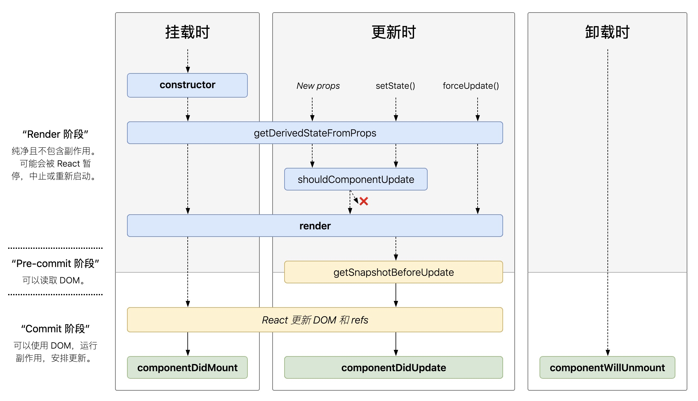

# 理解react生命周期

这个文档很水, 全当复习下基础知识了. 使用react以来都是用`constructor`, `componentDidMount`, `componentWillUnmount`, `render`这几个生命周期, 对其他生命周期了解甚少. 这次幸得长假学习了下, 记录下.

## react有哪些生命周期

### constructor()

#### 执行时机

挂载之前执行

#### 可以干嘛

- 初始化state
- 为事件处理函数绑定实例

### static getDerivedStateFromProps()

#### 执行时机

render之前

#### 干嘛的

返回一个对象来更新 state，如果返回 null 则不更新任何内容.

### render()

#### 执行时机

渲染的时候调用

#### 干嘛的

返回一个React元素供渲染用

### componentDidMount()

#### 执行时机

组件插入到dom后执行

#### 可以干嘛

- 执行副作用的操作
- 添加订阅, 比如addEventListener
- 发请求

### shouldComponentUpdate()

### 执行时机

render之前

### 可以干嘛

决定是不是需要渲染

- getSnapshotBeforeUpdate()

### 执行时机

在最近一次渲染输出（提交到 DOM 节点）之前调用

### 干嘛的

使得组件能在发生更改之前从 DOM 中捕获一些信息（例如，滚动位置). 将返回值传递个componentDidUpdate

- componentDidUpdate()
- componentWillUnmount()

## 挂载时生命周期

constructor -> getDerivedStateFromProps -> render -> componentDidMount

## 更新时生命周期

getDerivedStateFromProps -> shouldComponentUpdate -> render -> getSnapshotBeforeUpdate -> componentDidUpdate

## 卸载时生命周期

componentWillUnmount()

## 总结

