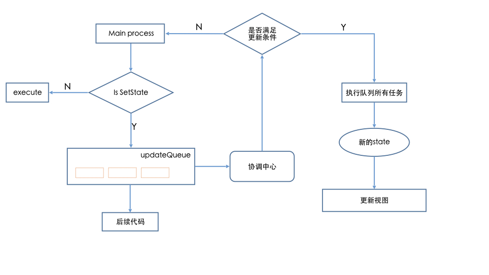
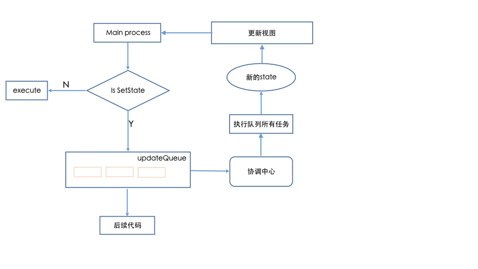

# 理解setState

近来在学习react源码, 最初是直接从入口一行一行的看, 结果跟着调用的函数跳转来跳去头都晕了. 后来决定带着一个目的去看源码, 每次看只研究一个东西. 一开始最想了解的就是充满魔性的setState. 本文是我对setState的一些理解, 不当之处欢迎留言指正.

## setState的魔性

看一下下边几个例子的输出情况.

1. 合成事件中的setState

```javascript
import React from 'react';

export default class SetState extends React.Component {
    constructor(props) {
        super(props);
    }

    state = {
        count: 0
    }

    click = () => {
        this.setState({
            count: this.state.count + 1,
        })
        console.log('count1', this.state.count);
        this.setState({
            count: this.state.count + 1,
        });
        console.log('count2', this.state.count);
    }

    render() {
        return (
            <div onClick={this.click}>
                count的值{this.state.count}
            </div>
        )
    }
}
// 打印:
// count1 0
// count2 0
```

2. 生命周期函数中的setState

```javascript
import React from 'react';

export default class SetState extends React.Component {
    constructor(props) {
        super(props);
    }

    state = {
        count: 0
    }
    
    componentDidMount () {
        this.setState({
            count: this.state.count + 1,
        })
        console.log('count1', this.state.count);
        this.setState({
            count: this.state.count + 1,
        });
        console.log('count2', this.state.count);
    }

    render() {
        return (
            <div>
                count的值{this.state.count}
            </div>
        )
    }
}
// 打印:
// count1 0
// count2 0
```

3. setTimeout中的setState

```javascript
import React from 'react';

export default class SetState extends React.Component {
    constructor(props) {
        super(props);
    }

    state = {
        count: 0
    }

    componentDidMount () {
        setTimeout(() => {
            this.setState({
                count: this.state.count + 1,
            })
            console.log('count1', this.state.count);
            this.setState({
                count: this.state.count + 1,
            });
            console.log('count2', this.state.count);
        }, 0);
    }

    render() {
        return (
            <div>
                count的值{this.state.count}
            </div>
        )
    }
}
// 打印:
// count1 1
// count2 2
```

4. Promise中的setState

```javascript
import React from 'react';

export default class SetState extends React.Component {
    constructor(props) {
        super(props);
    }

    state = {
        count: 0
    }

    componentDidMount () {
        Promise.resolve()
        .then(() => {
            this.setState({
                count: this.state.count + 1,
            })
            console.log('count1', this.state.count);
            this.setState({
                count: this.state.count + 1,
            });
            console.log('count2', this.state.count);
        })
    }

    render() {
        return (
            <div>
                count的值{this.state.count}
            </div>
        )
    }
}
// 打印:
// count1 1
// count2 2
```

从例1和例2的输出结果来看, 在setState后直接取state的值发现并没有更新, setState对state的更新似乎是个异步的过程; 

而从例3,例4输出结果来看, setState又是一个同步更新state的操作, 可以立即拿到更新的结果. 

也就是说, setState有的时候是异步的有的时候是同步的, 真是非常的魔性. 根据网上的一些文章和自己的实验可以得出如下结论.

- 在合成事件, 生命周期函数中的setState是异步批量更新的, 不能立即拿到更新的结果, 多次setState只会走一次render
- 在setTimeOut, setInterval, 原生事件, Promise中的setState是同步逐个更新的, 可以立即拿到更新的state, 而且每次setState都会走一次render

关于是批量更新还是非批量更新可以在render函数中打印查看

## setState魔性表现揭秘

1. 理解setState的异步批量更新

下边是个异步批量更新的示意图



这里将在合成事件, setTimeout等中的写的代码的调用称为Main Process.

例如下边`componentDidMount`中的代码的执行都叫Main process.

```javascript
componentDidMount () {
    this.setState({
        count: this.state.count + 1,
    });
    console.log('count1', this.state.count);
    this.setState({
        count: this.state.count + 1,
    });
    console.log('count2', this.state.count);
}
```

直接结合这段代码分析上边的这个看起来很牛x的图.

首先执行一个setState, 判断是setState操作, 创建一个更新任务加入更新队列, 交给协调中心, 协调中心判断不需要更新, 继续执行main Process中的代码.

遇到第一个console, 直接执行, 打印时取出了state, 显然state没更新还是原来的值,  然后再执行Main Process代码.

遇到第二个setState, 注意此时取出的state是没有更新的, 再创建一个更新任务到更新队列, 交给协调中心, 协调中心判断不需要更新, 继续执行main Process中的代码. 然后执行了console, 取出的state是没更新的.

一定时间后, 协调中心再次调度, 发现可以更新了, 然后执行了更新队列的两个任务, 得到一个新的state, 然后更新`this.state`和视图.

从以上分析可以了解到为什么两个console打印的都是之前的值.

这里有一个黑盒, 协调中心怎么运行的, 这是以后需要研究的了, 目前尚不清楚, 可以猜测这里边应该有个setTimeout 或者类似setTimeout的东西.

2. 理解setState的同步单个更新

下边是同步更新的示意图



这里还是结合一段代码来分析

```javascript
import React from 'react';

export default class SetState extends React.Component {
    constructor(props) {
        super(props);
    }

    state = {
        count: 0
    }

    click = () => {
        setTimeout(() => {
            this.setState({
                count: this.state.count + 1,
            })
            console.log('count1', this.state.count);
            this.setState({
                count: this.state.count + 1,
            });
            console.log('count2', this.state.count);
        }, 0);
    }
    
    render() {
        return (
            <div onClick={this.click}>
                count的值{this.state.count}
            </div>
        )
    }
}
```

首先遇到第一个setState, 判断是setState, 创建一个更新任务到更新队列, 然后进入协调中心, 协调中心通过某种手段判断出需要同步更新, 直接执行更新队列的任务, 得到新的state, 然后更新视图, 继续执行Main Process中的代码.

遇到console, 直接执行, 取出state(注意是更新了的)答应. 

然后又遇到setState(注意这里拿到的state是更新了的), 创建更新任务进入更新队列, 然后进入协调中心, 协调中心通过某种手段判断出需要同步更新, 直接执行更新队列的任务, 得到新的state, 然后更新视图, 继续执行Main Process中的代码.

再次遇到console, 直接执行, 取出state(注意是二次了的)答应. 

从以上分析可以看出同步setState为什么是同步的, 原因就在于他没有一个异步判断过程, 直接更新了state.

3. 几点待解决的问题

- 协调中心是什么时候, 如何判断出需要更新的
- 协调中心是如何识别是一个setState是在setTimeout还是在合成事件亦或生命周期等过程中的.

## 彩蛋

说一下阅读react源码的感受, 最开始直接看src目录, react部分还行, 比较容易. 

但是到了react-dom就不行了, 各种调用, 各种乱七八糟的东西, 有时跟着函数调用跳来跳去, 结果最开始想干嘛的都忘了, 这样读起来真的很打击人.

其实读源码更多不是了解其代码组织方法, 而是了解核心原理.

下边是几个小建议:

1. 带着问题读源码, 尤其是开始读的时候, 如果漫无目的的读, 会很没有成就感, 甚至是强烈的挫败感, 读了半天也不知道学到了什么
2. react-dom 的src代码组织十分复杂, 建议直接读开发版的编译产物, 都在一个文件里, 比较容易找.
3. 多用断点, 可以直接在开发版编译产物打断点看, 非常方便
4. 不要纠结太多细节, 要抱有不求甚解的态度, 不懂的地方可以暂时放过

## 小结

setState是一个容易让人困惑的东西, 尤其对react初学者来说, 可能感觉有点琢磨不透. 本文结合源码和自己的理解对setState的同步异步机制做了一些分析. 有些地方可能并不是十分准确, 但希望能帮助对setState同步异步机制困惑的朋友理解一些其中的原理. 最后需要记忆一下什么场景是同步更新, 什么场景是异步更新, 这个是写代码能实实在在用的到的.
