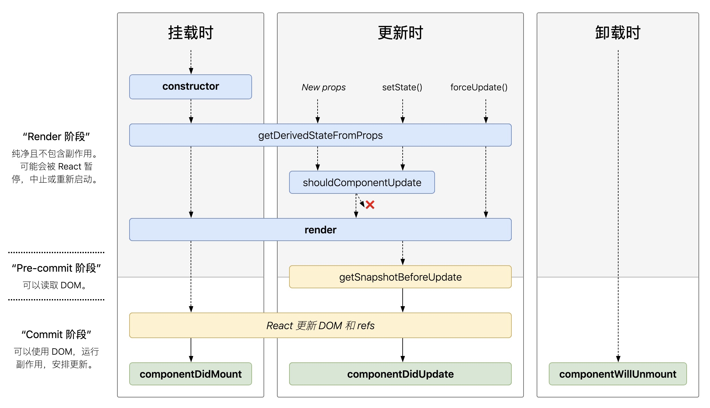

# 10秒钟理解react生命周期 

<!-- TOC -->

- [10秒钟理解react生命周期](#10秒钟理解react生命周期)
    - [不同阶段生命周期函数执行顺序](#不同阶段生命周期函数执行顺序)
        - [挂载(Mounting)](#挂载mounting)
        - [更新(Updating)](#更新updating)
        - [卸载](#卸载)
        - [总结](#总结)
    - [各生命周期函数介绍](#各生命周期函数介绍)
        - [常用的生命周期](#常用的生命周期)
            - [render()](#render)
            - [constructor()](#constructor)
            - [componentDidMount()](#componentdidmount)
            - [componentDidUpdate(prevProps, prevState, snapshot)](#componentdidupdateprevprops-prevstate-snapshot)
            - [componentWillUnmount()](#componentwillunmount)
        - [不常用的生命周期](#不常用的生命周期)
            - [shouldComponentUpdate(nextProps, nextState)](#shouldcomponentupdatenextprops-nextstate)
            - [static getDerivedStateFromProps(props, state)](#static-getderivedstatefrompropsprops-state)
            - [getSnapshotBeforeUpdate(prevProps, prevState)](#getsnapshotbeforeupdateprevprops-prevstate)
        - [与错误相关的生命周期](#与错误相关的生命周期)
            - [static getDerivedStateFromError()](#static-getderivedstatefromerror)
            - [componentDidCatch()](#componentdidcatch)

<!-- /TOC -->

> 慎点!这是一篇很水很水的文章, 抄自[react中文文档](https://zh-hans.reactjs.org/docs/react-component.html), 本文详细介绍了react生命周期函数执行顺序, 以及各生命周期函数的含义和具体作用. 

## 不同阶段生命周期函数执行顺序

### 挂载(Mounting)

挂载指的是组件被实例化并插入到dom中

顺序如下:

constructor -> getDerivedStateFromProps -> render -> componentDidMount

### 更新(Updating)

当state变化或者props变化会引起更新

顺序如下:

getDerivedStateFromProps -> shouldComponentUpdate -> render -> getSnapshotBeforeUpdate -> componentDidUpdate

### 卸载

指的是组件被从dom移除

只会执行一个生命周期:

componentWillUnmount

### 总结

这张图形象表示了不同阶段生命周期函数执行顺序.

## 各生命周期函数介绍

### 常用的生命周期

#### render()

render() 方法是 class 组件中唯一必须实现的方法。

当 render 被调用时，它会检查 this.props 和 this.state 的变化并返回以下类型之一：

- React 元素。通常通过 JSX 创建。例如，`
` 会被 React 渲染为 DOM 节点，`<MyComponent />` 会被 React 渲染为自定义组件，无论是 `
` 还是 `<MyComponent />` 均为 React 元素。
- 数组或 fragments。 使得 render 方法可以返回多个元素。
- Portals。可以渲染子节点到不同的 DOM 子树中。
- 字符串或数值类型。它们在 DOM 中会被渲染为文本节点
- 布尔类型或 null。什么都不渲染。（主要用于支持返回 test && `<Child />` 的模式，其中 test 为布尔类型。)

render() 函数应该为纯函数，这意味着在不修改组件 state 的情况下，每次调用时都返回相同的结果，并且它不会直接与浏览器交互。

**注意**

如果 shouldComponentUpdate() 返回 false，则不会调用 render()。

#### constructor()

在 React 组件挂载之前，会调用它的构造函数。

通常，在 React 中，在构造函数中只做两件事：

- 通过给 this.state 赋值对象来初始化内部 state。
- 为事件处理函数绑定实例

**注意:**

- 在为 React.Component 子类实现构造函数时，应在其他语句之前前调用 super(props)。否则，this.props 在构造函数中可能会出现未定义的 bug。
- 不要在里边调用setState

#### componentDidMount()

componentDidMount() 会在组件挂载后（插入 DOM 树中）立即调用。

在这里可以

- setState
- 操作dom
- 发请求获取初始数据

**注意**

你可以在 componentDidMount() 里可以直接调用 setState()。它将触发额外渲染，但此渲染会发生在浏览器更新屏幕之前。如此保证了即使在 render() 两次调用的情况下，用户也不会看到中间状态。请谨慎使用该模式，因为它会导致性能问题。通常，你应该在 constructor() 中初始化 state。如果你的渲染依赖于 DOM 节点的大小或位置，比如实现 modals 和 tooltips 等情况下，你可以使用此方式处理.

#### componentDidUpdate(prevProps, prevState, snapshot)

componentDidUpdate() 会在更新(dom已经更新)后会被立即调用。首次渲染不会执行此方法。

当组件更新后，可以在此处对 DOM 进行操作。如果你对更新前后的 props 进行了比较，也可以选择在此处进行网络请求。（例如，当 props 未发生变化时，则不会执行网络请求）。

你也可以在 componentDidUpdate() 中直接调用 setState()，但请注意它必须被包裹在一个条件语件里，正如上述的例子那样进行处理，否则会导致死循环。它还会导致额外的重新渲染，虽然用户不可见，但会影响组件性能。不要将 props “镜像”给 state，请考虑直接使用 props。

如果组件实现了 getSnapshotBeforeUpdate() 生命周期（不常用），则它的返回值将作为 componentDidUpdate() 的第三个参数 “snapshot” 参数传递。否则此参数将为 undefined。

#### componentWillUnmount()

componentWillUnmount() 会在组件卸载及销毁之前直接调用。

在这里可以释放资源, 比如清除定时器, removeEventListener

**注意**

这里边setState是无效的, 不应该调用

### 不常用的生命周期

#### shouldComponentUpdate(nextProps, nextState)

他的返回值可以决定是否重新渲染, 当 props 或 state 发生变化时，shouldComponentUpdate() 会在渲染执行之前被调用。返回值默认为 true。首次渲染或使用 forceUpdate() 时不会调用该方法。

这是一个性能优化的生命周期方法, 只有当你清楚的知道自己在做什么的是使用

#### static getDerivedStateFromProps(props, state)

getDerivedStateFromProps 会在调用 render 方法之前调用，并且在初始挂载及后续更新时都会被调用。它应返回一个对象来更新 state，如果返回 null 则不更新任何内容。

#### getSnapshotBeforeUpdate(prevProps, prevState)

getSnapshotBeforeUpdate() 在最近一次渲染输出（提交到 DOM 节点）之前调用。它使得组件能在发生更改之前从 DOM 中捕获一些信息（例如，滚动位置）。此生命周期的任何返回值将作为参数传递给 componentDidUpdate()。

此用法并不常见，但它可能出现在 UI 处理中，如需要以特殊方式处理滚动位置的聊天线程等。

### 与错误相关的生命周期

#### static getDerivedStateFromError()

此生命周期会在后代组件抛出错误后被调用。 它将抛出的错误作为参数，并返回一个值以更新 state

**注意**

getDerivedStateFromError() 会在渲染阶段调用，因此不允许出现副作用。 如遇此类情况，请改用 componentDidCatch()。

#### componentDidCatch()

此生命周期在后代组件抛出错误后被调用。 它接收两个参数：

- error —— 抛出的错误。
- info —— 带有 componentStack key 的对象，其中包含有关组件引发错误的栈信息。
componentDidCatch() 会在“提交”阶段被调用，因此允许执行副作用。 它应该用于记录错误之类的情况：

